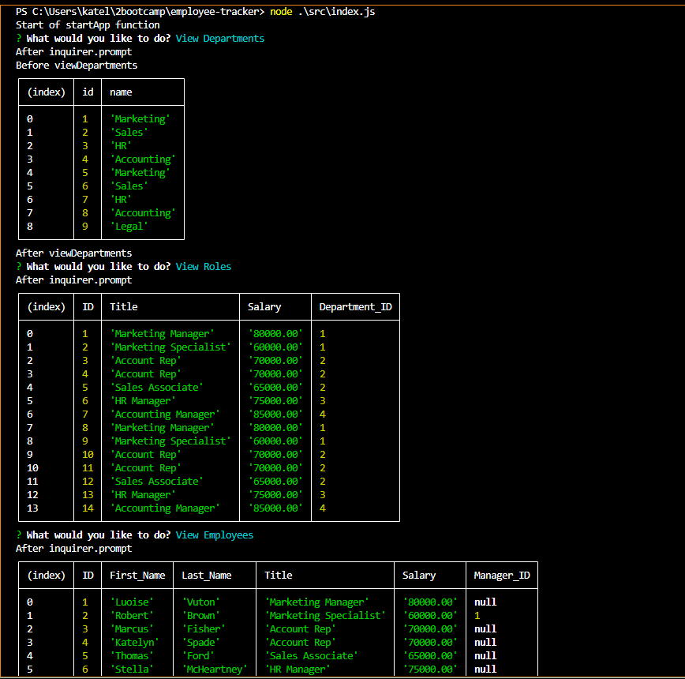

# 12 SQL: Employee Tracker


## User Story

```md
AS A business owner
I WANT to be able to view and manage the departments, roles, and employees in my company
SO THAT I can organize and plan my business
```

## Acceptance Criteria

```md
GIVEN a command-line application that accepts user input
WHEN I start the application
THEN I am presented with the following options: view all departments, view all roles, view all employees, add a department, add a role, add an employee, and update an employee role
WHEN I choose to view all departments
THEN I am presented with a formatted table showing department names and department ids
WHEN I choose to view all roles
THEN I am presented with the job title, role id, the department that role belongs to, and the salary for that role
WHEN I choose to view all employees
THEN I am presented with a formatted table showing employee data, including employee ids, first names, last names, job titles, departments, salaries, and managers that the employees report to
WHEN I choose to add a department
THEN I am prompted to enter the name of the department and that department is added to the database
WHEN I choose to add a role
THEN I am prompted to enter the name, salary, and department for the role and that role is added to the database
WHEN I choose to add an employee
THEN I am prompted to enter the employee’s first name, last name, role, and manager, and that employee is added to the database
WHEN I choose to update an employee role
THEN I am prompted to select an employee to update and their new role and this information is updated in the database 
```

## Installation
To use this application you'll need to do the following:
1. Clone the repository to your local envornment.
2. Install the necessary dependencies by running 'nom install'.
3. Creat a .env file a add you MySQL credentails.
4. Run the program using node src/index.js

## Usage
Once you've started the program by running node src/index.js, you'll be shown a list items to vies modify and add. Choose the option you are looking for and follow the prompts.

## Links

https://drive.google.com/file/d/1RC886u8V3eg2smgvPmTd1n5V-ltR8KPb/view

https://github.com/KatelynnMM/employee-tracker/tree/main

